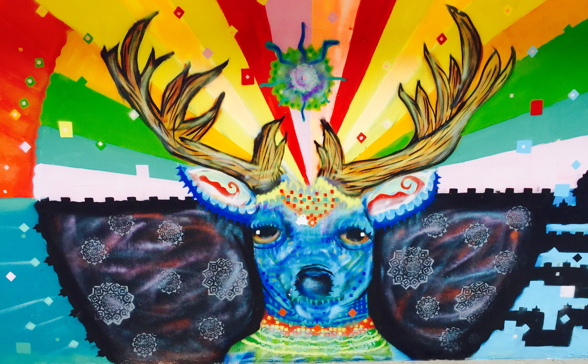

# Dig Hum Project
### Below is the abstracts for my Individual and Group Project 

Above image taken in Pureta Vallerta, Mexico 

## Group Project
In the Group Project folder you will find the powerpoint Presantaion 

Our group focused on Big Data, as it is the all pervasive term in the Digtal humanities. We focus on the accessibility of Data collection at an unprecedented scale and problems this poses as well as potential solutions to this within the Digital Humanities fields.	We selected three readings; “Critical Questions for Big Data” by Dana Boyd and Kate Crawson, “The differences between Digital Humanities and Digital History” by Stephen Robertson, and “Against the Cultural Singularity” by Alvin Liu. These readings together help us illustrate our issue with Big Data, provide some context within the digital humanities, and explore possible solutions to enable more people seeking to use Big Data.

### Individual Project 
My Individual Project focused on the idea of Local voices on governance. I want to get a better understanding of how people saw their goverment. As I am interested in goverment instutions, I think Data is playing a huge role in this. I focused on Africa as it is a fascanitng place in regards to goverment and culture. I asked the research question: Does the local perception of how free their political interaction is, actually correlate to how their government rules? 
Though my coding didnt allow for a deep dive, I was able to see how locals view their goverment. I hope to dig deeper into this topic and travel to Africa, to see first hand! 
